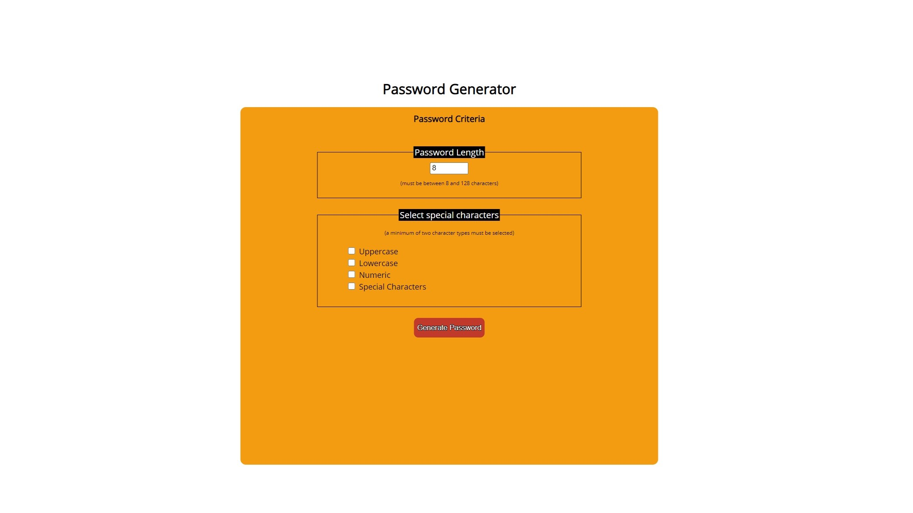

# 03 JavaScript: Password Generator

## Introduction 

The goal of this project are to create a web application that randomly generates a password based upon a series of criteria.

The criteria will be determined by user prompts and comprise the follow:

1. Length, between 8 and 128 characters.
2. Whether to include uppercase/lowercase characters.
3. Whether to include numeric and/or special characters.

Once all options have been selected, the page will then randomly generate a password and display it to the user.

## Live page

The password generator is available [here](https://ross-mc.github.io/javascript-password-generator/)

## Screenshots

{:height="225px" width="400px"}
{:height="225px" width="400px"}
{:height="225px" width="400px"}